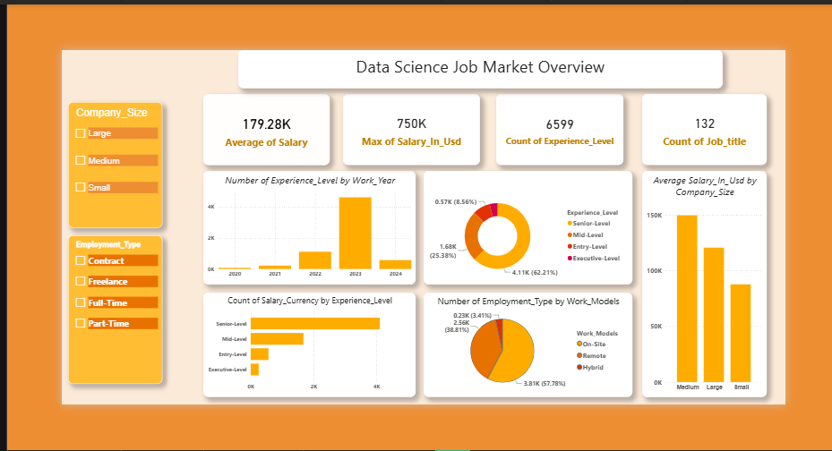

 # 📊 Data Science Job Market Analysis



---

## 📌 Table of Contents

- [Project Overview](#-project-overview)
- [Project Files](#-project-files)
- [Dataset Description](#-dataset-description)
- [SQL Analysis](#-sql-analysis)
- [Dashboard Pages](#-dashboard-pages)
- [Key Insights](#-key-insights)
- [Tools Used](#-tools-used)
- [How to Use](#-how-to-use)
- [Author](#-author)

---

## 📖 Project Overview

This project presents a comprehensive analysis of the **Data Science Job Market** using **Power BI**, **Excel**, and **SQL**. It explores salary distributions, experience level trends, employment types, work models, and geographic patterns across data science roles from **2020 to 2024**.

The goal is to provide clear, data-driven insights that help:
- 🎯 **Job seekers** understand salary expectations by role and experience
- 🏢 **Employers** benchmark compensation across company sizes and locations
- 📈 **Analysts** track how the data science job market has evolved over time

---

## 📁 Project Files

| File | Type | Description |
|---|---|---|
| `Data_Science_Job_Market.xlsx` | Excel | Raw dataset used as the data source |
| `data_science_queries.sql` | SQL | Queries for data exploration and analysis |
| `DataScienceJobMarket.pbix` | Power BI | Interactive dashboard file |
| `Overview.png` | Image | Screenshot of Page 1 – Overview |
| `Market_Trend.png` | Image | Screenshot of Page 2 – Market Trends |
| `Geographic_Insights.png` | Image | Screenshot of Page 3 – Geographic Insights |
| `README.md` | Markdown | Project documentation |

---

## 🗄️ Dataset Description

- **Source:** `Data_Science_Job_Market.xlsx`
- **Records:** 6,599 entries
- **Time Period:** 2020 – 2024

### Columns

| Column | Description |
|---|---|
| `Job_Title` | Title of the data science role (132 unique titles) |
| `Experience_Level` | Entry-Level, Mid-Level, Senior-Level, Executive-Level |
| `Employment_Type` | Full-Time, Part-Time, Contract, Freelance |
| `Work_Models` | Remote, On-Site, Hybrid |
| `Work_Year` | Year the salary was recorded |
| `Salary_In_Usd` | Salary standardized in USD |
| `Salary_Currency` | Original currency of the salary |
| `Company_Size` | Small, Medium, or Large |
| `Company_Location` | Country where the company is based (75 locations) |
| `Employee_Residence` | Country where the employee resides |

---

## 🗃️ SQL Analysis

The `data_science_queries.sql` file contains structured queries used to explore and validate the dataset prior to building the Power BI dashboard.

### Queries Include:

```sql
-- Average salary by experience level
SELECT Experience_Level, AVG(Salary_In_Usd) AS Avg_Salary
FROM data_science_jobs
GROUP BY Experience_Level
ORDER BY Avg_Salary DESC;

-- Top 5 highest paying job titles
SELECT Job_Title, AVG(Salary_In_Usd) AS Avg_Salary
FROM data_science_jobs
GROUP BY Job_Title
ORDER BY Avg_Salary DESC
LIMIT 5;

-- Remote job count by year
SELECT Work_Year, COUNT(*) AS Remote_Jobs
FROM data_science_jobs
WHERE Work_Models = 'Remote'
GROUP BY Work_Year
ORDER BY Work_Year;

-- Salary trends by year
SELECT Work_Year, AVG(Salary_In_Usd) AS Avg_Salary
FROM data_science_jobs
GROUP BY Work_Year
ORDER BY Work_Year;
```

> ⚙️ Run these queries by importing the dataset into your preferred SQL environment (MySQL, PostgreSQL, or SQL Server).

---

## 📊 Dashboard Pages

### Page 1 – Data Science Job Market Overview


A high-level summary of the entire job market with key KPIs and breakdowns.

#### 🔢 KPIs

| Metric | Value |
|---|---|
| Average Salary | **$179.28K** |
| Maximum Salary | **$750K** |
| Total Records | **6,599** |
| Unique Job Titles | **132** |

#### 📈 Visuals

- **Bar Chart** — Number of experience levels by work year *(peak in 2023)*
- **Donut Chart** — Experience level distribution *(Senior-Level leads at 62.21%)*
- **Horizontal Bar Chart** — Salary count by experience level
- **Donut Chart** — Employment type by work model *(Remote leads at 57.78%)*
- **Bar Chart** — Average salary by company size *(Large pays the most)*

#### 🎛️ Filters
`Company_Size` | `Employment_Type`

---

### Page 2 – Market Trends & Dynamics


A deeper look at salary trends over time and the distribution across roles and work models.

#### 🔢 KPIs

| Metric | Value |
|---|---|
| Total Salary (Sum) | **$961M** |
| Median Salary | **$139K** |
| Years Covered | **5** *(2020–2024)* |

#### 📈 Visuals

- **Area Chart** — Experience level count by work year and work model *(peak hiring: 2022–2023)*
- **Line Chart** — Average salary by work year *(steady growth to ~$160K by 2024)*
- **Bar Chart** — Average salary by experience level *(Executive-Level earns ~$190K)*
- **Donut Chart** — Experience level count by work model
- **Horizontal Bar Chart** — Top job titles by experience level *(Software Data Engineer leads)*

#### 🎛️ Filters
`Experience_Level` | `Employment_Type`

---

### Page 3 – Geographic & Company Insights


An exploration of how geography and company characteristics influence salaries and job availability.

#### 🔢 KPIs

| Metric | Value |
|---|---|
| Number of Company Locations | **75** |
| Total Remote Jobs | **2,561** |

#### 📈 Visuals

- **Horizontal Bar Chart** — Total salary by company location *(United States dominates)*
- **Donut Chart** — Salary count by company size *(Large companies: 88.8%)*
- **Stacked Bar Chart** — Salary count by company size and experience level
- **Bar Chart** — Average salary by company size *(Medium companies offer competitive pay)*
- **Bar Chart** — Average salary by employment type *(Full-Time earns the most)*

#### 🎛️ Filters
`Company_Size`

---

## 💡 Key Insights

> The following insights were derived from the combined SQL analysis and Power BI dashboard.

1. 🏆 **Senior-Level professionals dominate** the job market, making up **62.21%** of all records.
2. 🌍 **Remote work is the norm**, accounting for over **57%** of all employment arrangements.
3. 📈 **Salaries have grown consistently** from 2020 to 2024, approaching **$160K average** by 2024.
4. 💼 **Executive-Level roles** command the highest salaries, averaging close to **$190K**.
5. 🏢 **Large companies** offer the highest average compensation across all experience levels.
6. 🇺🇸 **The United States** accounts for the largest share of total salaries across all locations.
7. 👨‍💻 **Software Data Engineers** hold the highest role count among top job titles.
8. 📅 **2022–2023 saw a hiring surge**, visible in both the area chart and bar chart trends.
9. 💰 **Full-Time employees** earn significantly more than Contract, Part-Time, or Freelance workers.
10. 🏭 **Medium-sized companies** have the highest number of job records (88.8% of salary count).

---

## 🛠️ Tools Used

| Tool | Purpose |
|---|---|
| **Microsoft Power BI Desktop** | Dashboard design and interactive visualization |
| **Microsoft Excel** | Data source and initial data review |
| **SQL** | Data exploration, querying, and pre-analysis |
| **DAX (Data Analysis Expressions)** | Custom measures and KPI calculations |
| **Markdown** | Project documentation |

---

## 🚀 How to Use

### Power BI Dashboard
1. Download and open `DataScienceJobMarket.pbix` in **Power BI Desktop**
2. Ensure `Data_Science_Job_Market.xlsx` is in the same directory
3. Click **Home → Refresh** to reload the data if needed
4. Use the slicers on each page to filter interactively

### SQL Queries
1. Import the dataset into your SQL environment (MySQL, PostgreSQL, or SQL Server)
2. Create a table matching the dataset columns
3. Run the queries in `data_science_queries.sql` to explore the data

---

## 👤 Author

**[Your Name]**
- 🔗 GitHub: [github.com/yourusername](https://github.com/yourusername)
- 💼 LinkedIn: [linkedin.com/in/yourprofile](https://linkedin.com/in/yourprofile)

---

## 📄 License

This project is intended for **educational and portfolio purposes only**.  
Dataset sourced from publicly available data science salary records.

---

*⭐ If you found this project helpful, feel free to star the repository!*
